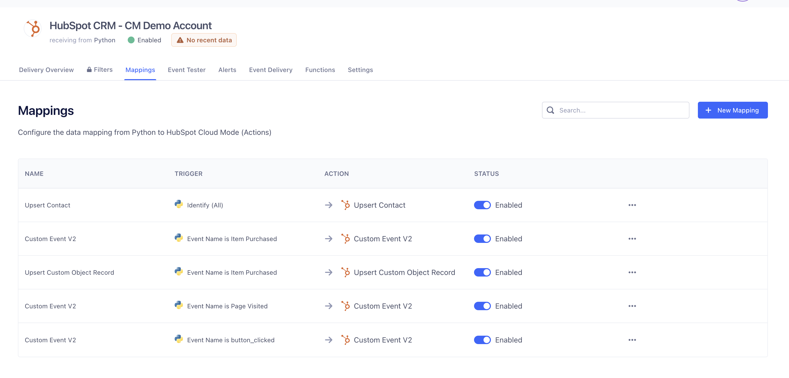

# HubSpot Test App with Segment Integration

This project demonstrates a test app that integrates Python with HubSpot and Segment. It includes sample mappings for contacts, deals, and custom events using Segment and HubSpot's Cloud Mode actions.

---
## Run the Notebook in Google Colab (Recommended)

For convenience, you can run the notebook in Google Colab using the following link:
Run in Google Colab

This version of the notebook has been modified to simplify execution:

The requirements.txt file and the dummies.py file are not required.

The Segment Write Key can be declared inline within the notebook for quick setup.

## **Prerequisites**

### Install Python
1. Install Python (3.8 or above):
   - **Windows**: [Download Python](https://www.python.org/downloads/windows/)
   - **Mac**: Use `brew install python` or download from [python.org](https://www.python.org).
   - **Linux**: Use your distribution’s package manager, e.g., `sudo apt install python3`.

2. Verify Python installation:
   ```bash
   python --version
   ```

### Install Jupyter Notebook
Ensure you have Jupyter installed. It will be installed with the dependencies below.

---

## **Setup Instructions**

### Clone the Repository
Clone the project repository to your local machine:
```bash
git clone <repository-url>
cd <repository-directory>
```

### Create a Virtual Environment
1. Create a virtual environment:
   ```bash
   python -m venv venv
   ```
2. Activate the virtual environment:
   - **Windows**:
     ```bash
     .\venv\Scripts\activate
     ```
   - **Mac/Linux**:
     ```bash
     source venv/bin/activate
     ```

### Install Dependencies
Install the required Python dependencies from `requirements.txt`:
```bash
pip install -r requirements.txt
```

---

## **Run the Application**

### Start the Flask App
Run the Flask application to serve the endpoints:
```bash
python app.py
```

### Access the Application
1. Open your browser and navigate to:
   ```
   http://127.0.0.1:5000/
   ```
2. Use the endpoints:
   - **Home**: Simulate button clicks and capture UTKs.
   - **Register**: Submit a sample email.
   - **Events**: Capture custom events and deals.

---

## **Run the Jupyter Notebook**

### Start Jupyter Notebook
1. Start the notebook server:
   ```bash
   jupyter notebook
   ```
2. Open the provided notebook (`Segment Events to HubSpot - Sample Notebook by Cat Media.ipynb`) in the Jupyter interface.

### Notebook Functions Documentation

#### **Overview**
This notebook is a proof of concept for using Twilio Segment Customer Data Platform integrated with HubSpot to send app events as Contact Object properties and Custom Events.

#### **Functions**

1. **Import Dependencies**
   - Loads necessary libraries including `segment.analytics`, `datetime`, `dotenv`, `random`, and a custom `dummies` module.
   - Sets up the Segment analytics client using the Write Key from the `.env` file.

   ```python
   analytics.write_key = write_key
   ```

2. **Create Sample User Profile**
   - Generates a sample user with random first name, last name, email, phone number, city, and country using helper functions and the `dummies` module.
   - Example output:
     ```
     John Doe john.doe@cm-demo-123.com +353100123456 Dublin Ireland
     ```

3. **Identify User**
   - Sends an `identify` event to Segment to update/create a contact in HubSpot with the following properties:
     - First Name
     - Last Name
     - Email
     - Phone
     - Address (City and Country)
     - Created At (Current Timestamp)
   
   ```python
   analytics.identify(id, {
       'first_name': fist_name,
       'last_name': last_name,
       'email': email,
       'phone': phone,
       'address': { 'city': city, 'country': country },
       'created_at': datetime.datetime.now()
   })
   ```

4. **Track Item Purchased Events**
   - Tracks multiple `Item Purchased` events for the user with the following properties:
     - Product Name
     - Email
     - Price
     - Transaction ID (randomly generated)
   - Example:
     ```python
     analytics.track(id, 'Item Purchased', {
         'product_name': 'Test Product 1',
         'email': email,
         'price': 100,
         'transaction_id': random_string(8)
     })
     ```

   - Three sample events are tracked in the notebook:
     - Product 1: 100 USD
     - Product 2: 200 USD
     - Product 3: 300 USD

---

## **Segment Configuration**

### Configure Segment Workspace
1. Log in to your Segment account and create a new source:
   - **Source Type**: Python
   - **Name**: Test App

2. Add the Segment Write Key to your `.env` file:
   ```env
   SEGMENT_WRITE_KEY=your_segment_write_key
   ```

3. In Segment, configure your mappings:
   - **Identify**: Upserts contact data in HubSpot.
   - **Track Events**:
     - `item_purchased`: Logs purchases in HubSpot with custom properties.
     - `page_visited`: Tracks page views with UTKs.
     - `button_clicked`: Tracks button interactions.

4. Add destination settings for **HubSpot Cloud Mode Actions**:
   - **Event Name**: Map Python events to HubSpot custom events.
   - **Associated Record Details**: Associate contacts and custom objects using emails or UTKs.
   - **Object Type**: Configure properties for `deals`, `contacts`, etc.

### Test the Integration
1. Send test events from Python using the Segment SDK.
2. Verify the events and mappings in the Segment debugger.
3. Confirm that events appear in your HubSpot account under custom events or associated records.

---

## **Key Features**

- **Contact Upserts**: Automatically update or create contacts in HubSpot using Segment's identify events.
- **Custom Event Tracking**: Log custom events (e.g., `item_purchased`) with properties like price, product name, and operating system.
- **Deal Creation**: Generate HubSpot deals with associated contacts.
- **Anonymous Events**: Track events using UTKs before a contact is identified.

---

## **Troubleshooting**

- **Missing UTK**: Ensure the HubSpot tracking code is loaded and cookies are enabled.
- **Segment Write Key**: Verify your `.env` file contains the correct key.
- **Mapping Issues**: Check your Segment mappings for proper field configuration.

---

## **Screenshots**

### 1. **Segment Mappings**


### 2. **Segment - HubSpot Destination Contact Details**


### 3. **Segment - HubSpot Destination Event Details**


### 4. **Segment - HubSpot Destination Deal Details**

---

## **Future Enhancements**

- Add more custom properties for deals and contacts.
- Automate the creation of HubSpot custom objects.
- Improve UI/UX for registering and submitting events.

---

## **About**
This repository was created by **Juan Zabala**, Tech Lead at **Cat Media Ltd.**, HubSpot Partner and Business Technology Agency.

